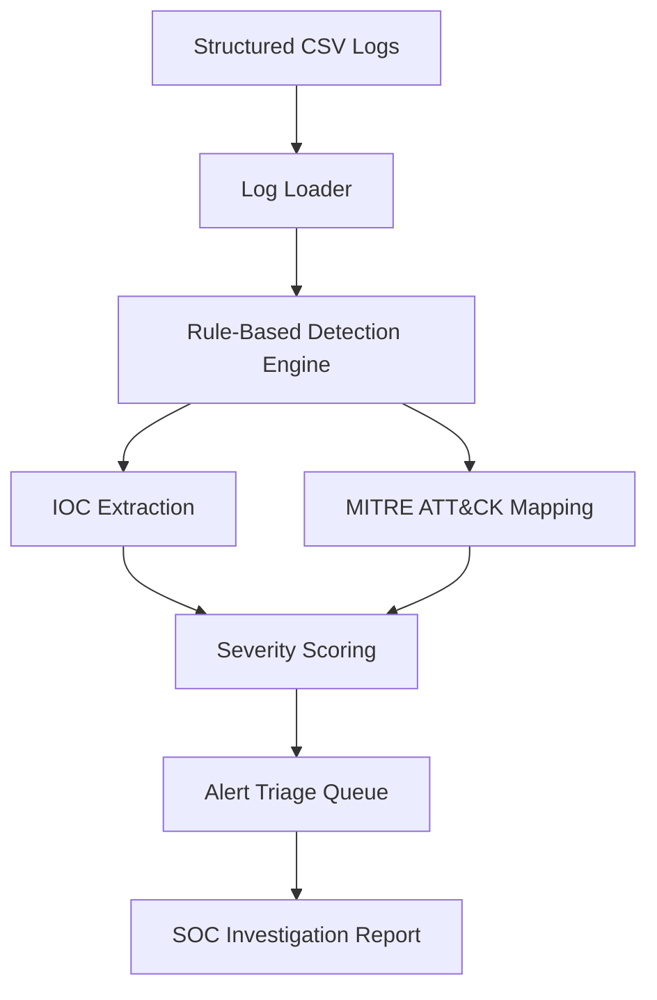
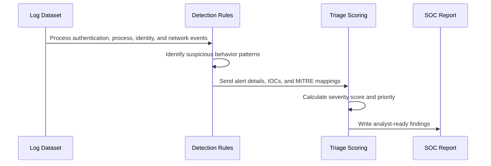

# Simulated Security Operations Pipeline

This project simulates a small SOC automation workflow in Python. It ingests structured log data, applies rule-based detections, extracts indicators of compromise, maps behavior to MITRE ATT&CK techniques, scores alert severity, and produces analyst-style investigation reports.

## What It Demonstrates

- Structured CSV log ingestion and normalization
- Rule-based detections for brute force activity, suspicious process execution, privilege escalation, beaconing, and data exfiltration
- IOC extraction for IP addresses, domains, and file hashes
- MITRE ATT&CK mapping for structured threat classification
- Severity scoring and alert triage queue generation
- LLM prompt engineering for SOC-style incident summaries
- Deterministic Markdown reports that can be reviewed without calling an external LLM

## Project Layout

```text
soc-pipeline/
├── data/sample_logs.csv
├── docs/soc-pipeline-infographic.png
├── docs/soc-pipeline-diagram.svg
├── reports/
├── run_pipeline.py
├── soc_pipeline/
│   ├── detections.py
│   ├── ioc.py
│   ├── loader.py
│   ├── mitre.py
│   ├── models.py
│   ├── pipeline.py
│   ├── reporting.py
│   └── triage.py
└── tests/test_pipeline.py
```

## Architecture Image


## Generated Infographic


## Pipeline Diagram



## Alert Lifecycle



## Run The Pipeline

```bash
python3 run_pipeline.py
```

Generated outputs are written to `reports/`:

- `alerts.json`: structured alert records
- `triage_queue.csv`: analyst queue sorted by priority and severity
- `soc_investigation_report.md`: SOC-style Markdown report with timeline, IOCs, MITRE mappings, and response actions

## Run Tests

```bash
python3 -m unittest discover -s tests
```

## Detection Rules

| Rule ID | Detection | MITRE ATT&CK Mapping |
|---|---|---|
| `AUTH-001` | Multiple failed logins followed by success | `T1110 Brute Force`, `T1078 Valid Accounts` |
| `PROC-001` | Encoded PowerShell, certutil transfer, credential dumping indicators | `T1059`, `T1105`, `T1003` |
| `ID-001` | Privileged group membership change | `T1098 Account Manipulation` |
| `NET-001` | Repeated periodic outbound network activity | `T1071 Application Layer Protocol` |
| `NET-002` | Large outbound transfer to external destination | `T1041 Exfiltration Over C2 Channel`, `T1071` |

## Resume-Ready Summary

Built a simulated security operations pipeline using Python to process structured log datasets and detect anomalous behavior patterns. Developed rule-based detection logic to identify suspicious activity, extract IOCs, map detected behaviors to MITRE ATT&CK techniques, generate SOC-style investigation reports, and simulate alert triage based on severity scoring.
